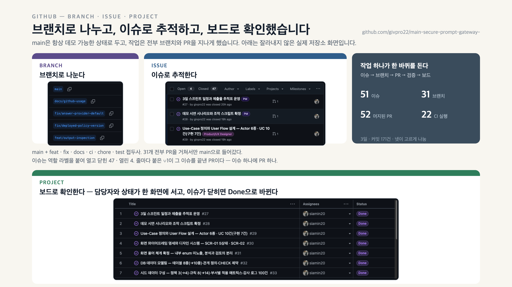
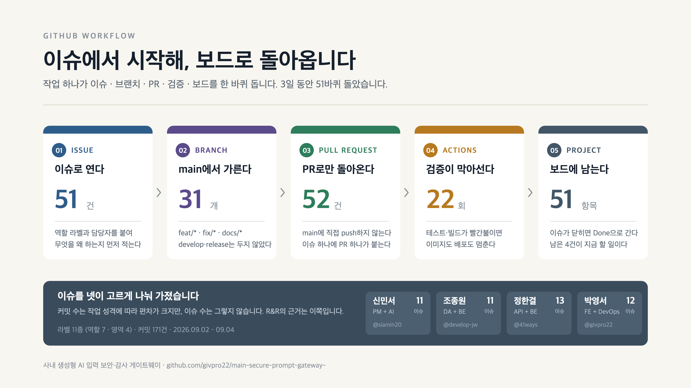

# GitHub 활용 — 발표용 도해와 캡처

## 슬라이드용 그림 두 장

두 장 다 1920×1080 · 2배율이고, 발표자료와 같은 배경색(`#F8F6F0`)·같은 하단 밴드(`#3A4C5C`)를 쓴다. 슬라이드 사이에 끼워도 남의 장표로 보이지 않는다.

### 1. `evidence.png` — 브랜치·이슈·프로젝트, 실제 화면



**"잘 썼다"를 보여주려면 이쪽이다.** 세 축을 나란히 두고 칸마다 진짜 저장소 화면을 박았다. 브랜치 이름(`feat/` · `fix/` · `docs/` · `ci/` · `chore/` · `test/`), 역할 라벨이 붙은 이슈 목록과 `Open 4 / Closed 47`, 담당자와 Status가 선 보드.

**캡처는 자르지 않는다.** 박스 비율에 맞춰 잘라 넣었더니 이슈 제목과 보드의 Status 칸이 잘려 나갔다. 지금은 통째로 넣고 박스 쪽을 이미지 비율에 맞춘다 — 그래서 세 칸의 폭이 서로 다르다. 대신 원본을 찍을 때 브라우저를 확대(1.6 / 1.45 / 1.0배)하고 **행을 적게** 담았다. 행이 많을수록 슬라이드에서 글자가 작아진다.

### 2. `workflow.png` — 한 바퀴 도는 순서



화면이 아니라 **순서**를 말하는 판이다. 이슈에서 열고 브랜치로 갈라 PR로 돌아오고 검증이 막아서고 보드에 남는다 — 다섯 칸이 그 한 바퀴이고 칸마다 실제 숫자가 붙어 있다. 하단 밴드는 그 51바퀴를 넷이 어떻게 나눠 가졌는지다.

### 다시 만들기

숫자를 고칠 일이 생기면 `build.mjs`의 `STEPS`·`FOOT`, `build-evidence.mjs`의 `PANELS`만 손대면 된다. 캡처를 새로 찍었으면 `crops/`의 파일을 갈아 끼우고 `PANELS`의 `iw`·`ih`(원본 크기)와 `offX`(어느 쪽 끝을 보일지)를 맞춘다.

```bash
node docs/github/build.mjs
node docs/github/build-evidence.mjs
"/Applications/Google Chrome.app/Contents/MacOS/Google Chrome" --headless --disable-gpu \
  --hide-scrollbars --force-device-scale-factor=2 --default-background-color=F8F6F0 \
  --window-size=1920,1080 --screenshot=docs/github/workflow.png \
  "file://$PWD/docs/github/workflow.svg"
```

의존성이 없다. 표준 라이브러리만 쓴다.

## 근거 캡처

"이슈랑 Projects를 썼다"는 말은 캡처 한 장으로는 증명이 안 된다. 이슈가 **PR로 이어졌고**, PR이 **CI를 통과해 main으로 갔고**, 그 결과가 **보드에 반영됐다**는 사슬이 보여야 한다. 도해가 순서를 말하고, 아래 5장이 그것이 실제로 있었다는 근거가 된다. 슬라이드에 근거까지 넣을 자리가 없으면 백업으로 들고만 있어도 된다.

## 캡처 5장

| 파일 | 무엇이 보이는가 |
|---|---|
| `01_issue_detail.jpg` | 이슈 #118 하나. 역할 머리말·목표·구성·판단 구조, 담당자, 역할 라벨, **Projects 연결(Status Done)**, **Development에 연결된 PR** |
| `02_issue_list.jpg` | 이슈 51건 목록. Open 4 / Closed 47, 역할 라벨 색깔, 각 줄의 `⑂1`이 연결된 PR |
| `03_project_board.jpg` | Projects 보드. 담당자별로 갈린 51건과 Status |
| `04_actions.jpg` | Actions 실행 이력. PR마다 검증이 돌고 main 머지마다 파이프라인이 도는 것 |
| `05_contributors.jpg` | 사람별 커밋 수와 코드 증감 |

슬라이드에 넣을 것은 위의 그림 둘이고, 이 5장은 질문이 들어왔을 때 열어 보여줄 원본이다. **한 장만 고르면 `01_issue_detail.jpg`다.** 이슈 하나에 역할·라벨·보드·PR이 전부 걸려 있어서 사슬 전체가 한 화면에 들어간다.

## 숫자

3일(2026-09-02 ~ 09-04) 기준이다.

| | |
|---|---|
| 이슈 | 51건 (닫힘 47 · 열림 4) |
| 머지된 PR | 52건 |
| 커밋 | 171건 (09-02 51 · 09-03 111 · 09-04 9) |
| 브랜치 | 31개. `main` + `feat/*`·`fix/*`·`docs/*`·`chore/*` |
| Actions 실행 | 22회 |
| 라벨 | 11종 (역할 7 · 영역 4) |

이슈 담당자는 41ways 13 · givpro22 12 · siamin20 11 · develop-jw 11로 갈렸다. **4명이 고르게 나눠 가졌다는 것이 R&R 슬라이드의 근거다** — 커밋 수는 사람마다 작업 성격이 달라 편차가 크지만 이슈 수는 그렇지 않다.

## 쓸 때 주의할 것 둘

**Projects의 Burn up 차트는 쓰지 않는다.** 보드를 3일차에 만들어서 51건이 전부 마지막 날 하루에 생기고 끝난 것처럼 그려진다. 실제 진행과 다르다.

**"PR 1인 리뷰" 문구는 근거가 없다.** 머지된 PR 52건 중 GitHub 리뷰 기록이 0건이다. 평가자가 PR 하나만 눌러도 리뷰 탭이 비어 있는 게 보인다. 슬라이드에서는 실제로 한 것 — 이슈로 나누고, 브랜치로 갈라고, PR로만 main에 넣고, CI가 막아섰다 — 로 바꿔 쓰는 편이 안전하다.

## 다시 찍기

전부 로그인 상태에서 아래 주소를 열어 찍은 것이다.

```
https://github.com/givpro22/main-secure-prompt-gateway-/issues/118
https://github.com/givpro22/main-secure-prompt-gateway-/issues?q=is%3Aissue+sort%3Acreated-asc
https://github.com/users/givpro22/projects/4
https://github.com/givpro22/main-secure-prompt-gateway-/actions
https://github.com/givpro22/main-secure-prompt-gateway-/graphs/contributors
```
